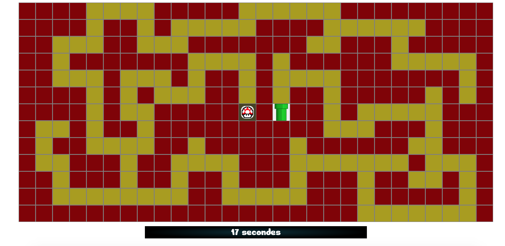

# :mushroom: Maze Game :mushroom:

* Solo project made by me: [Joelle Everaert](https://github.com/Joelle-Everaert) :blush:

* 25.11.2020

## What is this ?
Creation of a maze in javascript.  
Move the mushroom using the arrows on your keyboard.  
The goal of the game --> win of course BUT don't hesitate to lose (once at least :wink: )

## Context  

During my Web Dev training at **[BeCode](https://becode.org)**

## Purpose?
Put into practice our knowledge learned during the training course.

## Languages used?
* HTML 5
* CSS 3
* JavaScript

## Framework
No! 

## Overview :collision:
*Click on the picture* :wink:

### Original instruction

> [Link](https://github.com/becodeorg/bxl-hopper-1-25/tree/master/The%20Hill/projects/2.amazeing)